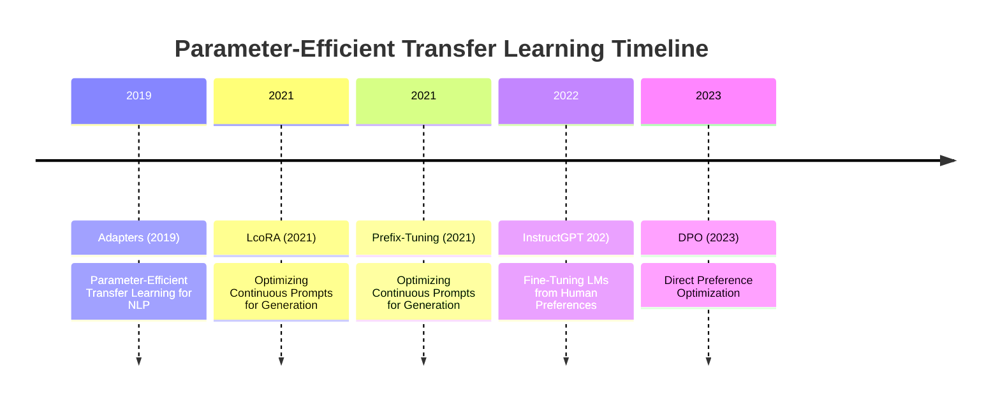

## LLM Finetuning Framework, important resource(LLM Leader board), framework to goal analysis, finetuning enterprise level expectation, important research paper

## LLM Finetuning Framework

-   **Hugging Face for LLM Fine-Tuning**
    1.  Huge Model Hub (100,000+ Models)
    2.  Transformer Library = Industry Standard
    3.  Fine-Tuning Made Easy
    4.  PEFT + LoRA for Efficient Fine-Tuning
    5.  Datasets Library
    6.  Trainer + Accelerate = Fast & Distributed
    7.  Hugging Face Hub
    8.  Evaluation, Tokenizers, & Inference Support
-   **DeepSpeed**
    1.  ZeRO Memory Optimization (ZeRO)
    2.  Faster Training (CPU Offloading, Kernel Fusion)
    3.  Gradient Accumulation + Activation Checkpointing
    4.  Model Parallelism + Pipeline Parallelism
    5.  Checkpointing + Resume + Logging
-   **LLaMA Factory**
    1.  LoRA/QLoRA Fine-Tuning
    2.  Minimal Setup / CLI-Friendly
    3.  Supports 100+ Hugging Face LLMs
    4.  Multi-GPU, DeepSpeed, FSDP (Fully Sharded Data Parallel), Flash Attention(super-optimized attention algorithm )
    5.  Chat Templates + SFT Format Support
    6.  Integrated Evaluation + MMLU/TruthfulQA
    7.  Export to GGUF / GPTQ / HF
-   **Unsloth**
    1.  Fastest LoRA Fine-Tuning
    2.  Low VRAM Usage - Train LLM on Colab T4 !
    3.  One-Line LLM Loading (with LoRA-ready model)
    4.  Integrated PEFT + Hugging Face Compatibility
    5.  Supports Multiple Model and Multimodal
    6.  Torch Compile + Flash Attention
-   **Axolotl**
    1.  All-in-One Finetuning Powerhouse
    2.  No Code - Just YAML Config
    3.  Supports All Open LLMs (100+ HF models)
    4.  DeepSpeed + FSDP + Flash Attention Support
    5.  Smart Prompt Templates + Chat Datasets
    6.  Post-Finetune Export
    7.  Active Dev Community
-   **Colossal-AI**
    1.  Multiple Parallelism Techniques
    2.  Zero Redundancy Optimizer (ZeRO)
    3.  Auto-Parallelism with Colossal-Auto
    4.  Memory Optimization
    5.  Integration with PyTorch
-   **LightLLM / vLLM**
    1.  Paged Attention(Memory-efficient attention)
    2.  Batching engine
    3.  Supports HF models
    4.  OpenAI-Compatible API
    5.  Streaming support
    6.  Quantization compatible
-   **OpenLLM (BentoML)**
	Production-Ready LLM Serving
    1.  Supports Fine-Tuned Models from HF + PEFT
    2.  BentoML Ecosystem = Deployment Superpowers
    3.  Multi-Model Serving
    4.  Auto-Generate API + CLI
    5.  Easy Integration with LangChain, LlamaIndex
-   **FastChat (LMSYS)**
    1.  Fine-Tuning Support for Open LLMs
    2.  Chat-Based Instruction Fine-Tuning
    3.  Multi-GPU + DeepSpeed Training
    4.  Fast Inference & Serving
    5.  OpenAI-Compatible API
-   **SkyPilot**
    1.  Multi-Cloud Support (AWS, GCP, Azure, Lambda Cloud, etc.)
    2.  GPU Spot Auto-Recovery
    3.  Checkpoint Mounting
    4.  Cluster Abstraction
    5.  Auto-Tuner
    6.  Job Scheduling
    7.  Easy Integration

## Important Resource (LLM Leader board)

1.  https://github.com/pdaicode/awesome-LLMs-finetuning
2.  https://github.com/Curated-Awesome-Lists/awesome-llms-fine-tuning/tree/main
3.  https://github.com/mmarius/awesome-finetuning

## Finetuning Enterprise Level Expectation

When a company plans to fine-tune LLMs at the enterprise level, their expectations are not limited to just training a model. They look for an entire structured pipeline, proper governance, cost optimization, and planning that is centered around the actual use case.

1.  Clear Use-Case Definition
2.  High-Quality, Domain-Specific Dataset
3.  Data Governance & Privacy
4.  Model Selection & Fine-Tuning Strategy
    4.1 Base Model Decision
    4.2 Fine-Tuning Type
5.  Infrastructure & Compute Requirements
6.  Fine-tuned models lifecycle managed (MLOps & CI/CD for Models), Deployment
7.  Evaluation & Benchmarking
8.  Risk Management & Guardrails
9.  Cost & ROI Awareness
10. Explainability & Auditing
11. Fast Training = Fast Time-to-Market
12. Adaptive Framework = Plug-n-Play Architecture
13. Dynamic Resource Adaptation
14. Auto-Resume & Fault Tolerance
15. Minimal Code Change, Maximum Flexibility
16. Community Support

**Smart framework choice**

Hugging Face + PEFT / LLaMA-Factory / Unsloth / DeepSpeed / Colossal-AI / Axolotl

## Important Research Paper

| Model     | Year | Training Strategy                                                                       | Highlights                                                                                                    |
| --------- | ---- | --------------------------------------------------------------------------------------- | ------------------------------------------------------------------------------------------------------------- |
| BERT      | 2018 | Masked Language Modeling (MLM) + Next Sentence Prediction (NSP)                           | Bidirectional encoder; revolutionized NLP tasks like QA and NER.                                                |
| GPT       | 2018 | Autoregressive Language Modeling + Supervised Fine-Tuning                                | Unidirectional decoder; laid the foundation for ChatGPT-style models.                                          |
| ULMFiT    | 2018 | LM pretraining → task-specific fine-tuning with discriminative learning rates                | First practical transfer learning approach in NLP; enabled effective fine-tuning on small datasets.            |
| T5        | 2020 | Text-to-Text Transformer                                                                | Converted all NLP tasks into text-to-text format; pretrained on C4 dataset.                                   |
| LLaMA 2   | 2023 | Pretrained on 2T tokens; fine-tuned for dialogue (LLaMA-2-Chat)                            | Open-source models ranging from 7B to 70B parameters; optimized for dialogue use cases.                        |
| Mistral 7B| 2023 | Pretrained with Grouped-Query Attention (GQA) and Sliding Window Attention (SWA)            | Efficient 7B model outperforming larger models like LLaMA 2 13B; optimized for reasoning and code generation. |
| DeepSeek-R1| 2024 | Reinforcement Learning from Human Feedback (RLHF)                                       | Demonstrates strong reasoning capabilities; trained via large-scale RL without supervised fine-tuning.        |
| GPT-3     | 2020 | Demonstrated prompting over fine-tuning → gave rise to RAG, Agents                      | Prompting Philosoph                                                                                           |
| MoE       | 2023 | Sparse Mixture-of-Experts architecture with expert routing                               | Scales model capacity efficiently; only a subset of experts activated per input, reducing computation.          |
| Switch Transformer |      |                                                                       |  First scalable MoE model; uses 1 active expert per token; 100B+ parameters                                                                                         |
| GShard    |      |                                                                       |  Predecessor to Switch Transformer; introduced MoE scaling for multilingual                                                                                         |
| Glam   |      |                                                                       |  1.2T parameters but uses only 97B per token — highly efficient                                                                                         |
| Mistral AI     |      |                                                                       |  Open-weight MoE model, 12.9B params total (2 of 8 experts active)                                                                                         |
| DeepSpeed-MoE|      |                                                                       |  MoE toolkit for building sparse LLMs using DeepSpeed                                                                                         |

## Research Papers with Official Links

1.  **LoRA (2021) – Low-Rank Adaptation**
    -   Concept: Trains low-rank matrices injected into Transformer layers for efficient fine-tuning.
    -   Paper: [LoRA: Low-Rank Adaptation of Large Language Models](https://arxiv.org/abs/2106.09685)
2.  **Adapters (2019) – Parameter-Efficient Transfer Learning for NLP**
    -   Concept: Inserts small trainable adapter modules into frozen models.
    -   Paper: [Parameter-Efficient Transfer Learning for NLP](https://arxiv.org/abs/1902.00751)
3.  **Prefix-Tuning (2021) – Optimizing Continuous Prompts for Generation**
    -   Concept: Optimizes a small continuous task-specific vector (prefix) while keeping the model parameters frozen.
    -   Paper: [Prefix-Tuning: Optimizing Continuous Prompts for Generation](https://arxiv.org/abs/2101.00190)
4.  **QLoRA (2023) – Efficient Finetuning of Quantized LLMs**
    -   Concept: Combines 4-bit quantization with LoRA for memory-efficient fine-tuning.
    -   Paper: [QLoRA: Efficient Finetuning of Quantized LLMs](https://arxiv.org/abs/2305.14314)
5.  **InstructGPT (2022) – Fine-Tuning LLMs from Human Preferences**
    -   Concept: Combines supervised fine-tuning with reinforcement learning from human feedback (RLHF).
    -   Paper: [Training language models to follow instructions with human feedback](https://arxiv.org/abs/2203.02155)
6.  **DPO (2023) – Direct Preference Optimization**
    -   Concept: Simplifies preference optimization by directly optimizing the policy without a separate reward model.
    -   Paper: [Direct Preference Optimization: Your Language Model is Secretly a Reward Model](https://arxiv.org/abs/2309.10649)
7.  **Self-Instruct (2022)**
    -   Concept: Models generate their own instructions to fine-tune without human labels.
    -   Paper: [Aligning Language Models with Self-Generated Instructions](https://arxiv.org/abs/2212.10580)
8.  **Scaling Laws for Neural Language Models (2020)**
    -   Concept: Demonstrates how model performance scales with model size, data, and compute.
    -   Paper: [Scaling Laws for Neural Language Models](https://arxiv.org/abs/2001.08361)
9.  **Efficient Training to Fill in the Middle (2022)**
    -   Concept: Introduces a strategy to fine-tune models on "fill-in-the-middle" tasks.
    -   Paper: [Efficient Training of Language Models to Fill in the Middle](https://arxiv.org/abs/2207.14255)

## Timeline of Parameter-Efficient Transfer Learning

	
## Framework to Goal Analysis

| No. | Goal                               | Description                                      |
|-----|------------------------------------|--------------------------------------------------|
| G1  | General Fine-Tuning                | SFT / supervised tuning                          |
| G2  | Speed & Efficiency                 | LoRA, QLoRA, 4-bit, VRAM savings, time reduction |
| G3  | RLHF / DPO / PPO                   | Reinforcement fine-tuning                        |
| G4  | Multi-GPU / Distributed Training   | FSDP, DeepSpeed, etc.                           |
| G5  | OpenAI-Style Model Serving         | Chat completion API, LangChain use              |
| G6  | RAG Compatibility                  | Embedding models + serving + retrieval             |
| G7  | Quantization + Export              | For local/Ollama use                             |
| G8  | Low-RAM (Colab) Tuning           | T4 or ≤16GB cards                                |
| G9  | Training Large Models (13B-65B)    | Memory-shared, 8+ GPU setups                     |
| G10 | Auto Parallelism & Memory Tuning | Auto tensor/pipeline splitting                  |
| G11 | Fast Token Streaming (Inference)   | Streaming outputs (RAG/chatbots)                 |
| G12 | Kubernetes / Cloud Deployment Ready| Prod-ready serving and infra control             |

| Framework             | G1  | G2  | G3      | G4  | G5  | G6  | G7  | G8  | G9  | G10 | G11 | G12 |
|----------------------|-----|-----|---------|-----|-----|-----|-----|-----|-----|-----|-----|-----|
| Hugging Face         | ✅   | ✅   | ✅       | ✅  | ✅   | ✅   | ❌   | ❌   | ❌   | ❌   | ❌   | ❌   |
| LLaMA Factory        | ✅   | ✅   | △ DPO only | ❌   | ❌   | ❌   | ✅   | ✅   | ❌   | ❌   | ❌   | ❌   |
| Axolotl              | ✅   | ✅   | ❌       | ✅   | ❌   | ❌   | ✅   | ✅   | ❌   | ❌   | ❌   | ❌   |
| Unsloth              | ✅   | ✅   | ❌       | ❌   | △   | △   | ❌   | ✅   | ❌   | ❌   | ❌   | ❌   |
| SkyPilot             | ❌   | ✅   | ❌       | ✅   | ✅   | ❌   | ❌   | ❌   | ❌   | ✅   | ❌   | ✅   |
| DeepSpeed            | ❌   | △   | ❌       | ✅   | ❌   | ❌   | ❌   | ❌   | ❌   | ❌   | ❌   | ❌   |
| FSDP                 | △   | △   | ❌       | ✅   | ❌   | ❌   | ❌   | ❌   | ❌   | ❌   | ❌   | ❌   |
| Colossal-AI          | ❌   | △   | ❌       | ✅   | ❌   | ❌   | ❌   | ❌   | ✅   | ✅   | ❌   | ❌   |
| OpenLLM              | ❌   | ❌   | ❌       | ❌   | ✅   | ✅   | ✅   | ❌   | ❌   | ❌   | ❌   | ✅   |
| FastChat             | ✅   | ❌   | ❌       | ❌   | ✅   | ✅   | △   | ❌   | ❌   | ❌   | ✅   | ❌   |
| vLLM                 | ❌   | △   | ❌       | ❌   | ✅   | ✅   | ❌   | ❌   | ❌   | ❌   | ✅   | ✅   |
| LightLLM             | ❌   | ❌   | ❌       | ❌   | △   | ❌   | ❌   | ❌   | ❌   | ❌   | ✅   | △   |

✅ = Fully supported
△ = Industry-best for that goal
⚠ = Possible, but needs effort / not primary goal
❌ = Not supported / not designed for this use

## Recommendations per Goal

| Goal (Use-Case)                               | Best Framework(s)                         |
|-----------------------------------------------|------------------------------------------|
| General Finetuning (SFT)                       | Hugging Face, LLaMA Factory, Axolotl       |
| Speed/Efficiency (LoRA, QLoRA, Flash Attn, etc.)| Unsloth, Axolotl, LLaMA Factory           |
| RLHF / DPO / PPO                             | Axolotl, Hugging Face (TRL), Unsloth         |
| Multi-GPU / Distributed                       | DeepSpeed, FSDP, Axolotl, Colossal-AI     |
| Model Serving (OpenAI-style)                  | vLLM, OpenLLM, FastChat                  |
| RAG Integration Ready                          | vLLM, OpenLLM, FastChat, Hugging Face     |
| GGUF / Quantization Export (for Ollama)       | Axolotl, LLaMA Factory, Hugging Face, Unsloth|
| Colab / T4 GPU Friendly                       | Unsloth, LLaMA Factory                     |
| 13B-65B Training (Serious Scale)             | Colossal-AI, DeepSpeed + FSDP               |
| Auto Parallelism (Tensor/Layer-wise Split)    | Colossal-AI, SkyPilot (infra)               |
| Real-Time Token Streaming                      | vLLM, FastChat, LightLLM                  |
| Full Production Infra + API                   | OpenLLM, vLLM, SkyPilot                   |